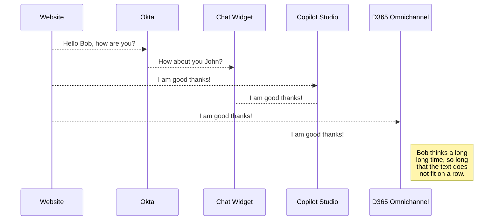

# Unified SSO with Copilot Agent and D365 Omnichannel

This sample app demonstrates unified SSO with Copilot Agent and D365 Omnichannel using a 3rd party authentication provider.  

## Authentication Process

You can render UML diagrams using [Mermaid](https://mermaidjs.github.io/). For example, this will produce a sequence diagram:

## Getting started

To run this sample app, including the end-to-end SSO flow with OKTA, you will need to:

1. Deploy sample app to Azure Web Services.
2. Create an OKTA developer account, or use an existing one
3. Create a new app integration in OKTA.
5. Configure the default access policy in the OTKA authorization server.
6. Setup manual authentication in Copilot Studio and D365 Omnichannel.
7. Update constants in the app. 
8. Redeploy sample app.

## Detailed instructions

### Deploy sample app to Azure Web Services

 1. Navigate to your project directory.
 
     `cd <your-react-app-folder>` 
 
 2. Initialize the local Git repository using the command.

	`git clone [repository_url]`
 
 3. Log in to Azure CLI.

	`az login` 
 
 4. Create an Azure Web App. Replace  `<>`  with your desired values.
 
	 `az group create --name <your-resource-group-name> --location <your-location>` 
 
	`az appservice plan create --name <your-app-service-plan-name> --resource-group <your-		resource-group-name> --sku F1 ` 

	`az webapp create --resource-group <your-resource-group-name> --plan <your-app-service-plan-name> --name <your-app-name> ` 
  
 5. Navigate to your React app's build directory.
 
	 `cd <your-react-app-folder>/build` 

 7. Deploy the build folder to the Azure App Services.
 
	 ` az webapp deployment source config-zip --resource-group <your-resource-group-name> --name <your-app-name> --src ./` 

8. Login into [Azure Portal](https://portal.azure.com/). Search for App Services and click on `<your-app-name>`. 

9. Verify **Status = Running** on the detail page. Copy the `Default domain` from the detail page. 

### Create an OKTA developer account
1. Sign up for an [OKTA developer account](https://developer.okta.com/signup/)

### Create a new app integration in OKTA.

1. Sign in to the OKTA admin dashboard at **https://{your domain}-admin.okta.com/** and create a new app integration with the following details.

|Application Property|Value|
|--|--|
| Sign-in method | OIDC - OpenID Connect |
| Application type | Single-Page Application |
| Grant type | Authorization Code, Interaction Code |
| Sign-in redirect URIs | the URL to `https://<Default domain>` |
| Sign-out redirect URIs | the URL to `https://<Default domain>/signout` |
| Trusted origins | your base URL i.e. `https://<Default domain>` |
| Assignments | allow access to specific users or groups based on your requirements |

3. After creating the app integration, note its Client ID

4. This sample app uses the OKTA sign-in widget which relies on the Interaction Code sign-in flow. To enable the Interaction Code flow:

1. Navigate to the API settings page under ***Security -> API***

2. Under the Authorization Servers tab, edit the default authorization server

3. Under Access Policies, edit the default policy rule

4. Under ***IF Grant type is*** -> ***Other grants***, click on **Interaction Code**.

5. Update the rule

6. You should also verify that CORS has been enabled for your base URL. On the same API page, under the ***Trusted Origins*** tab, your base URL i.e. `<your-app-name>` should appear under ***Trusted Origins*** with CORS enabled. In case your base url is missing, add the url with CORS enabled.

### Setup manual authentication in Copilot Studio and D365 Omnichannel.

> This section assumes that [Copilot handoff to Dynamics 365 Customer Service](https://learn.microsoft.com/en-us/microsoft-copilot-studio/configuration-hand-off-omnichannel?tabs=webApp) is configured.

#### D365 Omnichannel:

 1. Install [Git Bash](https://www.atlassian.com/git/tutorials/git-bash) on your machine.
 
 2. Generate a private key by running the command on git bash. 
 
	 `openssl genpkey -algorithm RSA -out private_key.pem -pkeyopt rsa_keygen_bits:2048`
 
 3. Open the `private_key.pem` using text editor. Copy the key and update the  `PRIVATE_KEY` environment variable in `.env` file in the root folder. 
 
> Make sure the entire text is copied beginning with "-----BEGIN PUBLIC KEY-----" and ending with "-----END PUBLIC KEY-----". 

 5. Generate a public key file by running the command on git bash. Rename the file `public.key` and store it `/keys` project folder. 
 
	 `openssl rsa -pubout -in private_key.pem -out public_key.pem`
 
 6. Create a chat authentication setting record in the D365 Admin App.
     1. In the site map of Copilot Service admin center, select **Customer Settings**.
	 
     2. In the **Authentication settings** section, select **Manage**.
	 
     3. Select **New Authentication Settings**, and then provide the following information on the **Add authentication setting** page:
    
   | Application Property | Value |
   |--|--|
   | Name | Enter a name for the authentication setting. |
   | Owner| Accept the default value or change it to a required value.|
   |Authentication type|By default, OAuth 2.0 can't be edited.|
   |Public key URL|`https://<Default domain>/publickey`|      
   |JavaScript client function|auth.getAuthenticationToken |

 7. In Copilot Service admin center, edit the chat widget in the Workstream settings, and then go to the **Behaviors** tab.
 
 9. In the **Authentication settings** box, browse and select the chat authentication record.

#### Copilot Studio:
 1. In the Copilot Studio **Settings** select **Security**. Set  **Authentication** to **Authenticate manually**. 
 
 2. Provide the following information on the **Authentication** page:
   
   | Application Property | Value |
   |--|--|
   | Redirect URL | `https://token.botframework.com/.auth/web/redirect` |
   | Service provider| Generic OAuth 2|
   | All other values| String - `placeholder`|
   
 3. This SSO pattern will work for copilots as a pass-through pattern, in which the token is sent to Copilot Studio, but not validated, it will even work when no values are provided for an authentication provider. 
 
 4. Create a new topic Validate Token from code in file `/copilot/Validate Token.yaml`.
 
 5. Provide the following placeholder and save topic.

| Placeholder | Value |
   |--|--|
   | OktaValidationURL | `https://{yourOktaDomain}/oauth2/` |
   | OktaValidationURI| `{yourOktaAuthServer}/v1/introspect`|
   | OktaClientId| Client ID of Okta app noted above.|

 6. Edit system topic `Sign in`. At the end of the topic, add a `redirect` node to topic `Validate Token`.

 7. Publish the agent.

### Update constants in the app.
1. Update app constants in `views/chatwidget.html.env` file. Save the file after updates.
| Placeholder | Value |
   |--|--|
   | baseUrl| `https://<mydomain>.okta.com`|
   | clientId| The Client ID of the OKTA application noted above.|
   | defaultdomain| `https://<Default domain>`|
   | botTokenUrl| In the Copilot Studio select **Channels** and **Web App**. Copy the **Connection String** value. |
2. Update environment variable in `.env` file in the root folder. Save the file after updates.
| Placeholder | Value |
   |--|--|
   | OKTA_ORG_URL| `https://<mydomain>.okta.com`|
   | OKTA_CLIENT_ID| The Client ID of the OKTA application noted above.|
   | OKTA_SCOPES| `okta.users.read`|
   | OKTA_REDIRECT_URI| `https://<Default domain>`|
   | OKTA_AUTHORIZATION_SERVER| `default` |

 

<em>Manual authentication without real values</em>

  
### Test the SSO flow

After signing-in using the OKTA sign-in widget, the user's access token will be sent to Copilot Studio and stored in ***System.User.AccessToken***, which can be used by copilot makers to make calls to protected APIs

 

<em>The OKTA sign-in widget</em>

  
  

 

<em>System.User.AccessToken is populated</em>

